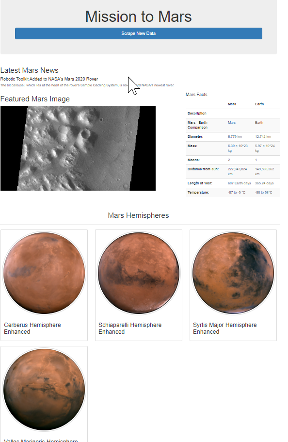

# Challenge10: Mission-to-Mars

This work scraped few webpages using spliter and beautiful soup. Then rendered to another page using flask.
bootstraps were used to make the page responsive.
Updated the button /table and images.

